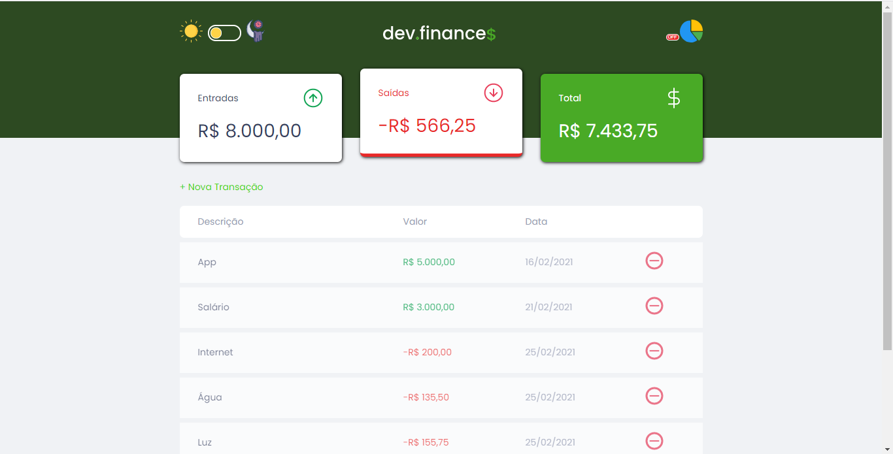
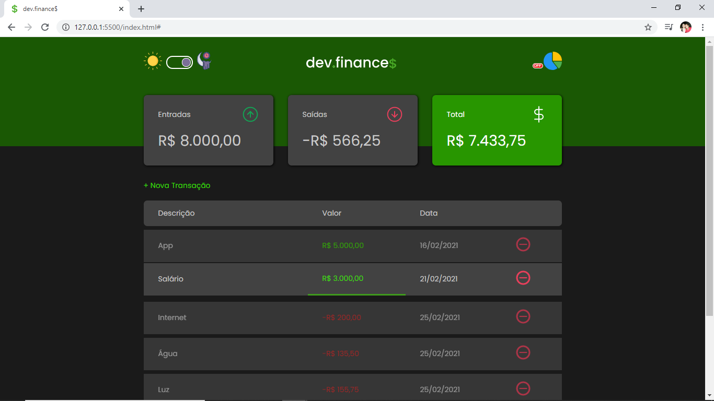
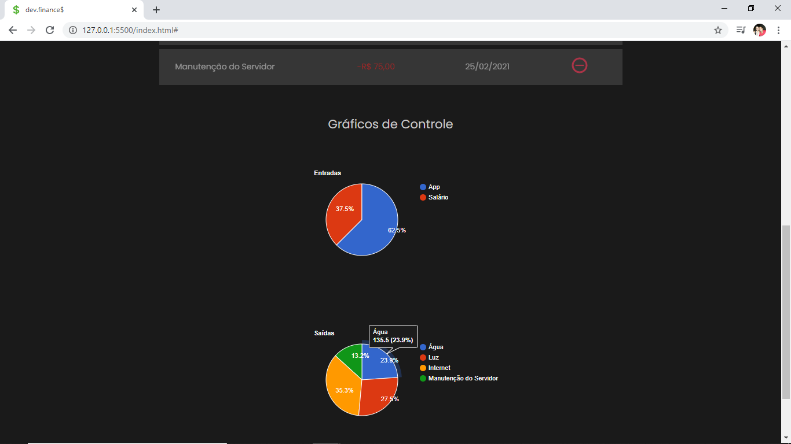
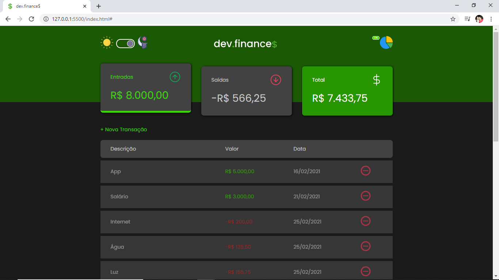

# maratona-discover-01
 # DevFinance$

---

## --> Uma Aplicação Web que te ajuda a gerenciar sua vida financeira de forma simples e usual...

---

### ==> 📸 Screenshots 📸:
	
 #### • Screenshots:
 
 
 
 

---

### ==> 📝 Resumo da Aplicação:
 #### • O projeto original foi desenvolvido pela Rocketseat, através da Maratona Discover, da qual participei, o conceito por trás da aplicação é facilitar sua vida financeira através de uma Aplicação Web, anotando todas as suas entradas e saídas de dinheiro, com descrição da transação, valor e sua data, você tem mais controle da sua vida financeira, do quanto está ganhando, do quanto deve gastar, e quanto está lhe restando, no final de um mês, por exemplo. 

---

 #### • Como usá-lo?
  --> Para começar, adicione uma transação clicando em "+ Nova Transação", depois, preencha todos os campos do formulário de cadastro de transação e clique em "Salvar", caso queira cancelar a ação, clique em "Cancelar". Adicione quantas transações achar necessário, todas elas serão exibidas logo abaixo do botão de adicionar uma transação. Para remover uma transação, basta clicar no botão em vermelho que está ao lado da data da transação que deseja remover.

  --> As transações cujo valor está em vermelho, são categorizadas como "Saídas", basicamente, suas despesas, já as com valor em verde, são categorizadas como "Entrada", para ver a diferença entre suas entradas e saídas, observe o card "Total".

  --> Para alternar entre o Modo Escuro e o Modo Claro do App, clique no botão localizado ao lado esquerdo da Logo DevFinance.

  --> Já para habilitar os Gráficos de Pizza, clique no botão localizado ao lado direito da Logo DevFinance.
  
  --> Este é o App, simples e usual, como sua vida financeira deve ser... 😉💲

---

### ==> ⚙️Funcionalidades do App:
1. Adicione e Remova Transações. 💲 As transações contam com: Descrição, Valor e Data.
2. Habilite o Modo Escuro (Dark Theme), e desfrute de uma experiência moderna e única. 🌜
3. Experimente os Gráficos de Pizza. Além de ser de fácil entendimento, os gráficos permitem que você observe, em detalhes, quais transações são de maior, ou menor valor, e onde, por exemplo, estão seus maiores gastos. 📊
4. Animações e Cores. O que seria de um App sem cores e sem "vida" não é mesmo? Através das animações inseridas em todo o App, você, usuário, tem uma experiência fluida e direta com todo o App. 🚀
5. Responsividade. A responsividade do DevFinance está presente em todo o App, desde navegar entre as transações, alternar entre os Modos Claro e Escuro, habilitar os Gráficos de Pizza, até mesmo, ao fomulário para adicionar uma nova transação, o que torna a Aplicação usual em telas de Computador, Tablets, e Celular... 📱

---

### ==> 🚀🤝💜 Agradecimentos:
 Se tem uma coisa que eu preciso dizer, é OBRIGADO ROCKETSEAT, por proporcionar um evento que, além de gratuito, é, acima de tudo, extremamente prático e profissional...
 Vocês não tem noção do quanto eu tô feliz, esse foi meu primeiro projeto "real", e meu primeiro repositório aqui, no GitHub, aprendi muita coisa, não só na Maratona Discover, mas em toda a plataforma da Rocketseat, sem falar na comunidade do Discord, que é sensacional...
	**Obrigado Rocketseat** 🚀💜
	#MaratonaDiscover01
	#NeverStopLearning
